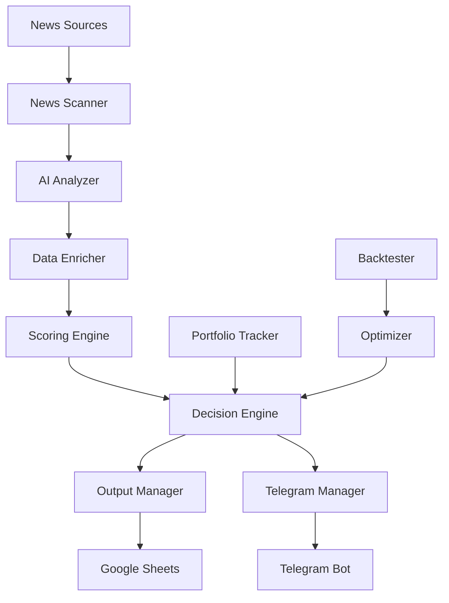

# 🚀 JMONEY Trading System

An intelligent, fully-automated trading signal system that scans financial news, identifies trading opportunities using AI (OpenAI GPT-4o/Gemini), and provides real-time notifications via Telegram with comprehensive Google Sheets tracking.

[](https://www.python.org/downloads/)
[](LICENSE)
[](https://core.telegram.org/bots)

---

## 📋 Table of Contents

- [⭐ Key Features](#-key-features)
- [🏗️ System Architecture](#️-system-architecture)
- [🔄 7-Stage Processing Pipeline](#-7-stage-processing-pipeline)
- [⚡ Quick Start](#-quick-start)
- [🛠️ Installation & Setup](#️-installation--setup)
- [🐍 Python Version Compatibility](#-python-version-compatibility)
- [⚙️ Configuration](#️-configuration)
- [📊 Demo Mode](#-demo-mode)
- [📈 Backtesting & Optimization](#-backtesting--optimization)
- [🤖 Telegram Bot Commands](#-telegram-bot-commands)
- [📁 Project Structure](#-project-structure)
- [🔧 Troubleshooting](#-troubleshooting)
- [🎯 Advanced Features](#-advanced-features)

---

## ⭐ Key Features

### 🔍 **Intelligence & Analysis**
- **Multi-source news scanning** from 20+ configurable financial/crypto news websites
- **AI-powered asset identification** using OpenAI GPT-4o or Google Gemini
- **Advanced scoring algorithms** including technical analysis, macro sentiment, and ZS-10+ trap detection
- **Real-time portfolio tracking** with P/L calculations and performance metrics

### 📊 **Data & Market Coverage**
- **Multi-source market data** supporting 8 different data providers:
  - Stocks: Yahoo Finance, Google Finance, Polygon.io
  - Forex: Yahoo Finance (`EURUSD=X`), Google Finance, Polygon.io
  - Crypto: Binance, Coinbase, KuCoin, Kraken, Bybit, Gate.io, MEXC
  - Indices: Yahoo Finance, Google Finance
- **Smart fallback system** with automatic source switching on failures

### 🎯 **Trading & Risk Management**
- **Dynamic position sizing** with configurable risk per trade (default: 1.5%)
- **ATR-based Stop Loss/Take Profit** calculations
- **4 trading strategies**: Boost, Zen, Caution, Neutral with different risk profiles
- **Confirmation logic** with customizable scoring thresholds

### 📱 **Notifications & Tracking**
- **Interactive Telegram bot** with 10+ commands and rich message formatting
- **Google Sheets integration** with 20+ data columns and duplicate detection
- **Real-time notifications** for new signals, daily summaries, and market events
- **Automated scheduling** with 4-hour workflow cycles

### 🧪 **Testing & Optimization**
- **Offline demo mode** with mock data (no API keys required)
- **Historical backtesting** with realistic trade simulation
- **AI-powered parameter optimization** for strategy improvement
- **Comprehensive logging** and error handling

---

## 🏗️ System Architecture



---

## 🔄 7-Stage Processing Pipeline

### 🔍 **Stage 1: News Scanning**
- **Module:** `core/news_scanner.py`
- **Config:** `config/sources.json`
- Scrapes headlines from financial news websites
- Supports custom sources and rate limiting

### 🧠 **Stage 2: AI Asset Identification**
- **Module:** `core/ai_analyzer.py`
- **Models:** OpenAI GPT-4o-mini or Google Gemini-1.5-flash
- Identifies tradeable assets from news headlines
- Extracts tickers, catalyst descriptions, and asset types

### 📈 **Stage 3: Data Enrichment**
- **Modules:** `core/data_enricher.py`, `core/data_fetcher.py`
- **Config:** `config/data_sources.json`
- Validates tickers and fetches OHLCV market data
- Supports automatic ticker format correction

### 🎯 **Stage 4: Scoring Engine**
- **Module:** `core/scoring_engine.py`
- **Calculations:**
  - **Technical Score (0-10):** RSI, MACD, Moving Averages, Bollinger Bands
  - **ZS-10+ Score (0-10):** Volume/price trap detection
  - **Macro Score (0-10):** AI-analyzed economic impact
  - **Sentiment Score (0-10):** AI-analyzed market sentiment

### ⚖️ **Stage 5: Decision Engine**
- **Module:** `core/decision_engine.py`
- **Config:** `config/scoring_metrics.json`
- Maps scores to trading strategies
- Calculates entry/exit prices and position sizes
- Applies confirmation criteria

### 📊 **Stage 6: Output Management**
- **Module:** `core/output_manager.py`
- Exports to Google Sheets with rich formatting
- Duplicate detection and data validation
- 20+ columns of trade data

### 📱 **Stage 7: Telegram Notifications**
- **Modules:** `core/telegram_manager.py`, `core/telegram_bot.py`
- Rich message formatting with emojis and markdown
- Interactive bot commands
- Scheduled notifications and alerts

---

## ⚡ Quick Start

### 🚀 **Option 1: Full System (Live Trading)**

```bash
# 1. Clone and navigate
git clone <repository-url>
cd JMONEY

# 2. Install dependencies
pip install -r requirements.txt

# 3. Configure environment
cp .env.template .env
# Edit .env with your API keys

# 4. Run the system
py -3.10 main.py
# Or use: python main.py (if Python 3.10 is default)
# Or use: run.bat (Windows batch file)
```

### 🧪 **Option 2: Demo Mode (No API Keys)**

```bash
# 1. Navigate to demo
cd demo

# 2. Run demo workflow
python demo_main.py

# 3. Run demo backtesting
python run_backtest.py
```

---

## 🛠️ Installation & Setup

### 📋 **Prerequisites**
- Python 3.10+ (recommended)
- Internet connection (for live mode)
- API keys for chosen providers

### 🔧 **Step-by-Step Installation**

1. **Install Python Dependencies**
   ```bash
   pip install -r requirements.txt
   ```

2. **Configure Environment Variables**
   ```bash
   # Copy template
   cp .env.template .env
   
   # Edit with your values
   nano .env
   ```

3. **Required API Keys** (choose at least one AI provider)
   ```env
   # AI Provider (required - choose one or both)
   OPENAI_KEY=sk-your_openai_api_key_here
   GEMINI_API_KEY=your_gemini_api_key_here
   
   # Telegram (required for notifications)
   TELEGRAM_BOT_TOKEN=your_bot_token_from_botfather
   TELEGRAM_CHAT_ID=your_telegram_chat_id
   
   # Google Sheets (required for output)
   GOOGLE_APPLICATION_CREDENTIALS=your_service_account.json
   SHEET_NAME=your_sheet_name
   
   # Optional: Enhanced market data
   POLYGON_API_KEY=your_polygon_api_key
   ```

4. **Set up Google Sheets**
   - Create a Google Cloud service account
   - Download credentials JSON file
   - Share your target Google Sheet with the service account email
   - Set `GOOGLE_APPLICATION_CREDENTIALS` to the JSON file path

5. **Set up Telegram Bot**
   ```bash
   # 1. Create bot via @BotFather
   # 2. Get your chat ID by messaging @userinfobot
   # 3. Add both values to .env file
   ```

---

## 🐍 Python Version Compatibility

### ⚠️ **Important: Python Version Issues**

This project has been tested with **Python 3.10** and may have compatibility issues with newer versions.

**If you have multiple Python versions installed:**

```bash
# Check available versions
py -0

# Use Python 3.10 specifically
py -3.10 main.py

# Or use full path
C:/path/to/python310/python.exe main.py
```

**Windows Users:** Use the included `run.bat` file for easy execution:
```bash
# Simply run
run.bat
```

### 📦 **Dependency Notes**
- `python-telegram-bot==13.15` is pinned due to API changes in v20+
- `urllib3==1.26.15` is pinned to resolve telegram bot conflicts
- Some packages may require specific versions for compatibility

---

## ⚙️ Configuration

### 📁 **Configuration Files**

| File | Purpose | Key Settings |
|------|---------|--------------|
| `config/sources.json` | News sources | URLs, selectors, rate limits |
| `config/data_sources.json` | Market data providers | Source priorities, fallbacks |
| `config/prompts.json` | AI prompts | Asset identification, scoring prompts |
| `config/scoring_metrics.json` | Trading rules | Score thresholds, confirmation logic |
| `config/trading_config.json` | Risk settings | Position sizing, risk per trade |

### 🎛️ **Key Configuration Options**

```json
// scoring_metrics.json - Main trading rules
{
  "jmoney_confirmation": {
    "required_conditions": 3,
    "rules": {
      "technical_score": 7.5,      // Minimum technical score
      "macro_score": 6.0,          // Minimum macro score  
      "zs10_score_max": 4.0,       // Maximum trap score
      "catalyst_required": true     // Must have news catalyst
    }
  }
}
```

### ⏰ **Scheduling Configuration**
- **Default:** Runs every 4 hours
- **Customizable** in `main.py` setup_schedules()
- **Manual triggers** via Telegram `/fetch` command

---

## 📊 Demo Mode

The demo folder provides a complete offline simulation of the JMONEY system.

### 🎯 **Features**
- **No API keys required** - uses mock data files
- **Complete workflow simulation** - all 7 stages
- **Realistic backtesting** - demonstrates P/L tracking
- **Educational purpose** - understand system behavior

### 🚀 **Running Demo**

```bash
cd demo

# Run main demo workflow
python demo_main.py

# Output: Creates demo/output/ with:
# - signals.json (generated trading signals)
# - analysis_results.json (detailed scoring)
# - portfolio_summary.json (demo portfolio state)
```

### 📈 **Demo Backtesting**

```bash
cd demo

# Run backtesting simulation
python run_backtest.py

# Features:
# - Uses pre-defined win/loss outcomes
# - Generates dynamic equity curves
# - Shows profit/drawdown scenarios
# - Demonstrates reporting capabilities
```

### 📋 **Demo vs Live System**

| Feature | Demo | Live System |
|---------|------|-------------|
| News Scanning | Mock headlines | Real websites |
| AI Analysis | Simulated responses | OpenAI/Gemini APIs |
| Market Data | Static mock data | Real-time from multiple sources |
| Backtesting | Illustrative outcomes | Historical data analysis |
| Notifications | Console output | Telegram + Google Sheets |
| Purpose | Education/Testing | Production trading |

---

## 📈 Backtesting & Optimization

### 🔬 **Core Backtester** (`core/backtester.py`)
```python
# Features:
- Historical data fetching
- Realistic trade simulation
- Stop-loss/Take-profit execution
- Transaction costs and slippage
- Portfolio tracking
- Performance metrics
```

### 🧠 **AI-Powered Optimizer** (`core/optimizer.py`)
```python
# Capabilities:
- Parameter optimization using AI
- Historical performance analysis
- Automatic rule adjustment
- Multi-iteration testing
- Best parameter selection
```

### 📊 **Performance Metrics**
- Win Rate (%)
- Average Return per Trade (%)
- Maximum Drawdown (%)
- Sharpe Ratio
- Total Return (%)
- Number of Trades

### 🎯 **Optimization Process**
1. **Load historical signals** from Google Sheets
2. **Enrich with AI** asset type classification
3. **Run backtests** with different parameter sets
4. **AI suggests** new parameters based on results
5. **Update config** with optimal parameters

---

## 🤖 Telegram Bot Commands

### 📱 **Available Commands**

| Command | Description | Example |
|---------|-------------|---------|
| `/start` | Welcome message and bot info | `/start` |
| `/help` | Show all available commands | `/help` |
| `/signals` | Show recent trading signals | `/signals` |
| `/confirmed` | Show only confirmed signals | `/confirmed` |
| `/boost` | Show high-confidence signals | `/boost` |
| `/zen` | Show medium-confidence signals | `/zen` |
| `/caution` | Show low-confidence signals | `/caution` |
| `/neutral` | Show neutral signals | `/neutral` |
| `/portfolio` | Show portfolio performance | `/portfolio` |
| `/fetch` | Trigger manual workflow | `/fetch` |
| `/status` | Show system status | `/status` |

### 📞 **Interactive Features**
- **Rich formatting** with emojis and markdown
- **Strategy-specific** signal filtering
- **Real-time updates** on signal confirmations
- **Portfolio tracking** with P/L calculations
- **Manual workflow triggers** for immediate analysis

### 🔔 **Automatic Notifications**
- **New signals** with full details and reasoning
- **Daily summaries** at market open/close
- **Portfolio updates** when trades close
- **System alerts** for errors or important events

---

## 📁 Project Structure

```
JMONEY/
├── 📁 config/                    # Configuration files
│   ├── data_sources.json         # Market data source priorities
│   ├── sources.json              # Financial news sources
│   ├── prompts.json              # AI prompts for analysis
│   ├── scoring_metrics.json      # Trading rules and thresholds
│   └── trading_config.json       # Risk and account settings
│
├── 📁 core/                      # Main system modules
│   ├── __init__.py
│   ├── ai_analyzer.py            # AI integration (OpenAI/Gemini)
│   ├── backtester.py             # Historical backtesting engine
│   ├── data_enricher.py          # Asset data enrichment
│   ├── data_fetcher.py           # Multi-source market data
│   ├── decision_engine.py        # Trading strategy logic
│   ├── news_scanner.py           # Financial news scraping
│   ├── optimizer.py              # AI-powered optimization
│   ├── output_manager.py         # Google Sheets integration
│   ├── portfolio_tracker.py      # Portfolio and P/L tracking
│   ├── scoring_engine.py         # Signal scoring algorithms
│   ├── telegram_bot.py           # Telegram bot functionality
│   ├── telegram_manager.py       # Notification orchestration
│   └── trade_calculator.py       # Entry/exit calculations
│
├── 📁 demo/                      # Offline demo system
│   ├── demo_main.py              # Demo workflow
│   ├── run_backtest.py           # Demo backtesting
│   ├── requirements.txt          # Demo dependencies
│   ├── README.md                 # Demo documentation
│   ├── 📁 config/                # Demo configuration
│   ├── 📁 core/                  # Demo modules
│   ├── 📁 data/                  # Mock data files
│   ├── 📁 output/                # Demo results
│   └── 📁 utils/                 # Demo utilities
│
├── 📁 utils/                     # Utility modules
│   ├── __init__.py
│   └── logger.py                 # Centralized logging
│
├── 📁 data/                      # Application data
│   └── portfolio.json            # Portfolio state
│
├── 📁 logs/                      # Log files
│   ├── jmoney.log                # Main system logs
│   └── jmoney_confirmations.log  # Signal confirmations
│
├── 📁 test/                      # Test scripts
│   ├── __init__.py
│   ├── ai_provider_check.py      # AI provider testing
│   └── test_data_fetcher_smoke.py # Data fetcher tests
│
├── 📄 main.py                    # Main application entry point
├── 📄 requirements.txt           # Python dependencies
├── 📄 run.bat                    # Windows execution script
├── 📄 .env.template              # Environment configuration template
├── 📄 .env                       # Your API keys and settings
├── 📄 README.md                  # This documentation
├── 📄 deployments.json           # Deployment configurations
├── 📄 response.json              # API response cache
└── 📄 google_service_acct.json  # Google service account credentials
```

---

## 🔧 Troubleshooting

### 🐍 **Python & Dependencies**

**Multiple Python versions:**
```bash
# Check installed versions
py -0

# Use specific version
py -3.10 main.py

# Or install packages in correct version
py -3.10 -m pip install -r requirements.txt
```

**Telegram bot issues:**
```bash
# Common fixes
pip uninstall python-telegram-bot urllib3
pip install urllib3==1.26.15
pip install python-telegram-bot==13.15
```

### 🔑 **API & Authentication**

**OpenAI API errors:**
- Verify API key format: `sk-proj-...`
- Check usage limits and billing
- Test with: `export OPENAI_KEY=your_key`

**Google Sheets access:**
- Ensure service account JSON is correct
- Share sheet with service account email
- Check `GOOGLE_APPLICATION_CREDENTIALS` path

**Telegram setup:**
- Create bot via @BotFather
- Get chat ID from @userinfobot
- Test bot with `/start` command

### 📊 **Data & Market Issues**

**Market data failures:**
- Check ticker format (e.g., `BTC-USD` not `BTC`)
- Verify data source is available
- Review `config/data_sources.json` priorities

**News scanning problems:**
- Website structure changes may break scrapers
- Update selectors in `config/sources.json`
- Check for rate limiting or blocking

### 🚨 **Common Error Messages**

```bash
# "name 'os' is not defined"
# Fixed: Added import os to backtester.py

# "ModuleNotFoundError: telegram"
# Fix: Install compatible versions
pip install python-telegram-bot==13.15 urllib3==1.26.15

# "No module named 'core'"
# Fix: Run from JMONEY root directory
cd /path/to/JMONEY
python main.py

# "API rate limit exceeded"
# Fix: Add delays or upgrade API plan
```

### 🔍 **Debugging Tips**

1. **Check logs:** `logs/jmoney.log`
2. **Test components:** Use files in `test/` folder  
3. **Verify config:** Validate JSON files
4. **Run demo:** Test with `demo/demo_main.py`
5. **Check environment:** Verify `.env` file values

---

## 🎯 Advanced Features

### 🔄 **Scheduling & Automation**
- **4-hour cycles** with automatic restarts
- **Manual triggers** via Telegram
- **Background processing** with threading
- **Error recovery** and retry mechanisms

### 🎨 **Customization Options**
- **Add news sources:** Edit `config/sources.json`
- **Custom AI prompts:** Modify `config/prompts.json`  
- **Scoring adjustments:** Update `config/scoring_metrics.json`
- **Risk parameters:** Configure `config/trading_config.json`

### 📊 **Advanced Analytics**
- **Technical indicators:** RSI, MACD, Bollinger Bands
- **Volume analysis:** ZS-10+ trap detection
- **Sentiment analysis:** AI-powered news interpretation
- **Performance tracking:** Comprehensive P/L calculations

### 🔒 **Security & Reliability**
- **Environment variables** for sensitive data
- **Error handling** throughout the system
- **Logging and monitoring** for troubleshooting
- **Data validation** and duplicate detection

---

## 📞 Support & Contributing

### 🐛 **Bug Reports**
Please include:
- Python version (`python --version`)
- Error messages and logs
- Configuration details (without API keys)
- Steps to reproduce

### 🚀 **Feature Requests**
- New data sources
- Additional AI providers
- Enhanced scoring algorithms
- Custom notification channels

### 📚 **Documentation**
- Code is extensively commented
- Configuration files include examples
- Demo mode provides hands-on learning
